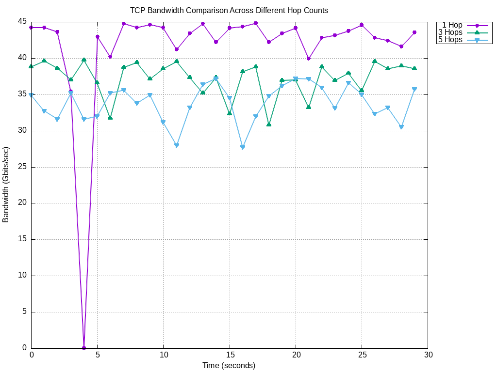
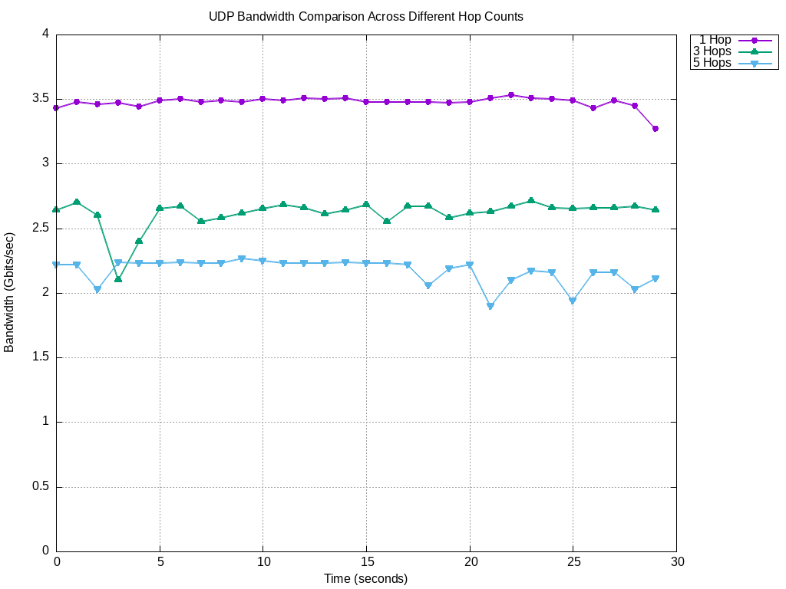

# NetHopAnalyzer

## Results

### TCP



### UDP



## How to use

### create a network topology with hops between 2 nodes

```bash
sudo python3 linear_topo.py -hop <hop amount>
```

### examine TCP & UDP bandwidth for 1, 3 and 5 hops

The following steps are used in 1 hop, replace 1 with 3 and 5 while examining in 3 and 5 hops

#### 1. create network topology with hops

```bash
sudo python3 linear_topo.py -hop 1
```

#### 2. examine TCP/UDP bandwidth

#### 2-1 open terminals for both hosts (h1 and h2)

under mininet CLI opened in step 1, use the following command

```bash
xterm h1 h2
```

#### 2-2 examine bandwidth and output results to file

We assume `h1` is the client and `h2` is the server

- server (h2)

  ```bash
  iperf3 -s
  ```

- client (h1)
  - the ip address of server (h2) can be found in the `inet` section of the `eth` interface using

    ```bash
    h2 ifconfig
    ```

  - TCP
    - `t`: time for sending packets

    ```bash
    iperf3 -c <server_ip> -t 30 > tcp-1-hop-raw.txt
    ```

  - UDP
    - `u`: stand for UDP
    - `b`: stand for bandwidth

    ```bash
    iperf3 -c <server_ip> -u -b 10G -t 30 > udp-1-hop-raw.txt
    ```

#### 2-3 extract time & bandwidth to another file

Before executing this step, you should have the following files:

- tcp-1-hop-raw.txt
- tcp-3-hop-raw.txt
- tcp-5-hop-raw.txt
- udp-1-hop-raw.txt
- udp-3-hop-raw.txt
- udp-5-hop-raw.txt

then use the python script to extract time and bandwidth

```bash
python3 extract_bandwidth.py
```

it should create the corresponding data files listed below:

- tcp-1-hop-data.txt
- tcp-3-hop-data.txt
- tcp-5-hop-data.txt
- udp-1-hop-data.txt
- udp-3-hop-data.txt
- udp-5-hop-data.txt

#### 3. draw graph

use the prepared gnuplot script and the following command to create graphs

```bash
gnuplot gnuplot/generate_tcp_graph > img/tcp_graph.png
gnuplot gnuplot/generate_udp_graph > img/udp_graph.png
```

### error handling

#### script stucks while creating network topology

solution: restart Open vSwitch

```bash
sudo systemctl restart openvswitch-switch
```
